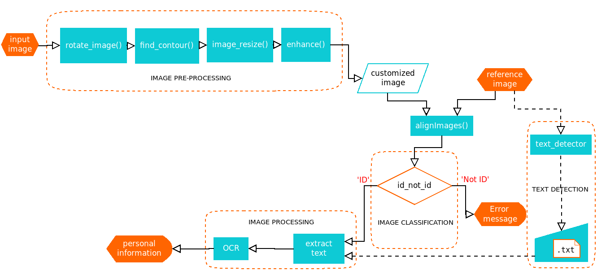

# Smart Identity


This is a project realized during my internship at Sonatel Senegal, submitted as part of the partial completion of my Master II at [AIMS Senegal](https://aims-senegal.org/). It consists in digitizing the ECOWAS identity card using OCR technique.

<p align="right">(<a href="#top">back to top</a>)</p>

<!-- GETTING STARTED -->
## Getting Started

1. Clone the repo
   ```sh
   https://github.com/marolAI/Smart-Identity.git
   ```
2. Change directory to `Smart-Identity`
   ```sh
   cd Smart-Identity
   ```
3. Install packages
   ```sh
   pip install requirements.txt
   ```
4. Run the server
   ```sh
   python ocr_server.py
   ```
5. Open `http://0.0.0.0:8080` to your browser.

<p align="right">(<a href="#top">back to top</a>)</p>

<!-- LICENSE -->
## License

Distributed under the MIT License. See `LICENSE.txt` for more information.

<p align="right">(<a href="#top">back to top</a>)</p>


<!-- CONTACT -->
## Contact

Andriamarolahy - [@Massa_Be](https://twitter.com/twitter_handle) - andriamarolahy.rabetokotany@aims-senegal.org

Project Link: [https://github.com/marolAI/Smart-Identity](https://github.com/marolAI/Smart-Identity)

<p align="right">(<a href="#top">back to top</a>)</p>


<!-- ACKNOWLEDGMENTS -->
## Acknowledgments

* [Sonatel Senegal](https://sonatel.sn/)


<p align="right">(<a href="#top">back to top</a>)</p>

